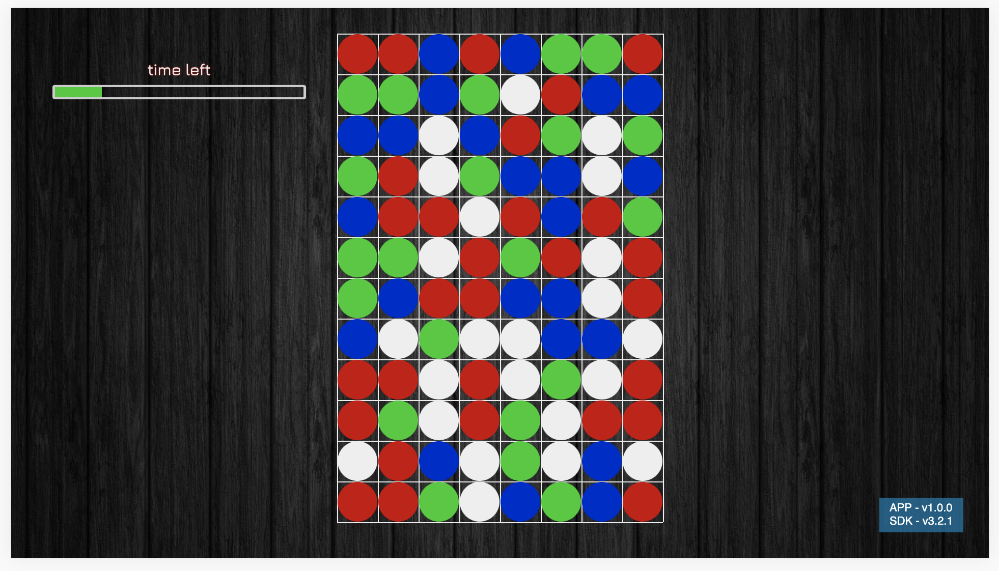
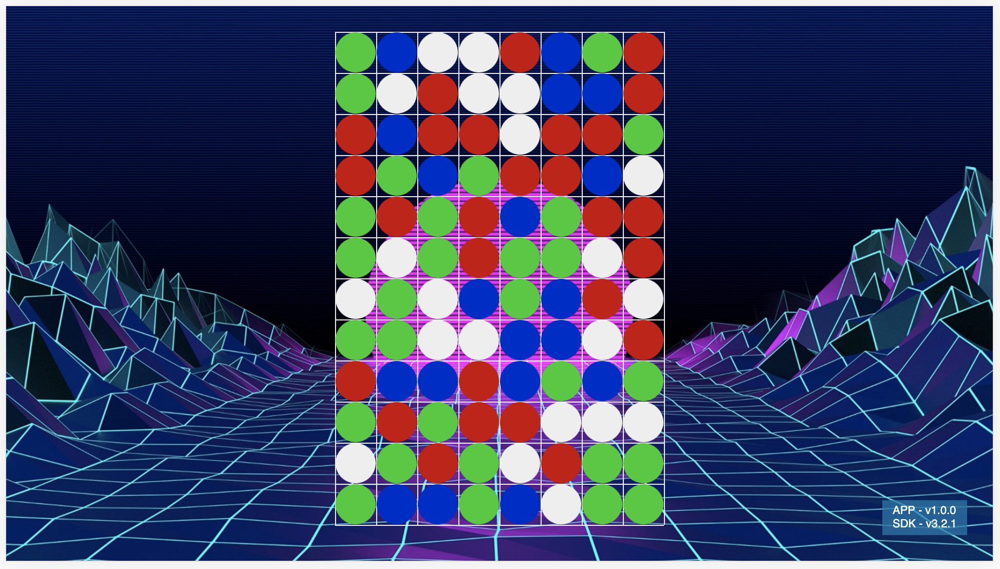

# Connect3

## com.jhderojasuva.connect3

Connect3 is the typical board game that you must connect three items one next to another in order to clean them and let more space to new ones.

There's two different styles:

- Time game. You have time to clear some
- Unlimited. No time, you can be forever waiting

## Images

Is a working progress, the images show can change over the time:



This is an example of a game with time limit. You have a time bar that will fill until you connect 3 dots/icons/similar images. Them, some time will be rested.



This is an example of a game with no time limit. You can be playing all the time you want.

## ToDo

Because it's a progress, there's a lot ToDos:

1. Refactor how to check and clean chips (I don't trust on what it's done)
2. Better selector (it's ugly!)
3. Icons, icons, icons, icons... I said icons?
4. Finish the time limit (rest when you complete something)
5. Better home page
6. Score board! (and save it on the browser storage -for now-)

### Getting started

> Before you follow the steps below, make sure you have the
[Lightning-CLI](https://rdkcentral.github.io/Lightning-CLI/#/) installed _globally_ only your system

```
npm install -g @lightningjs/cli
```

#### Running the App

1. Install the NPM dependencies by running `npm install`

2. Build the App using the _Lightning-CLI_ by running `lng build` inside the root of your project

3. Fire up a local webserver and open the App in a browser by running `lng serve` inside the root of your project


#### Developing the App

During development you can use the **watcher** functionality of the _Lightning-CLI_.

- use `lng watch` to automatically _rebuild_ your App whenever you make a change in the `src` or  `static` folder
- use `lng dev` to start the watcher and run a local webserver / open the App in a browser _at the same time_

#### Documentation

Use `lng docs` to open up the Lightning-SDK documentation.
