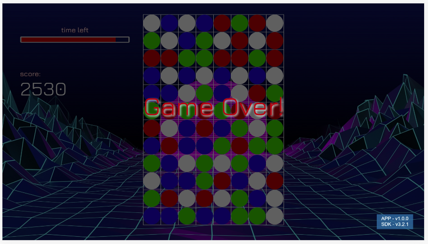
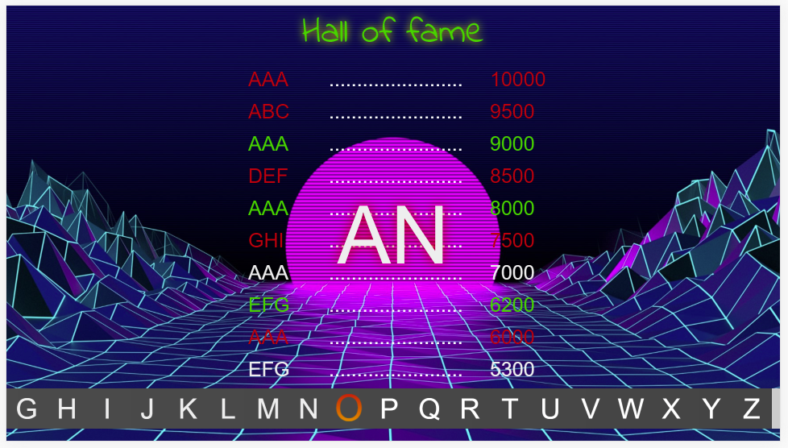

# Connect3

## com.jhderojasuva.connect3

Connect3 is the typical board game that you must connect three items one next to another in order to clean them and let more space to new ones. Based on Lightning!.

There's two different styles:

- Time game. You have time to clear some
- Unlimited. No time, you can be forever waiting

## Images

Is a working progress, the images show can change over the time:

This is an example of a game with time limit. You have a time bar that will fill until you connect 3 dots/icons/similar images. Them, some time will be rested.

This is an example of a game with no time limit. You can be playing all the time you want.

Addiding a new high score **into the hall of fame!**. The hall of fame is a browser storage so if you close the game and run it again the high scores are still there.

## ToDo

Because it's a progress, there's a lot ToDos:

1. Better selector (it's ugly!)
2. Icons, icons, icons, icons... I said icons?. Well graphics at all.
3. Better home page
4. Some small refactors!
5. Check how to check chips (this will be always there!)
6. Think on online game (means play with other users via a websocket server)
